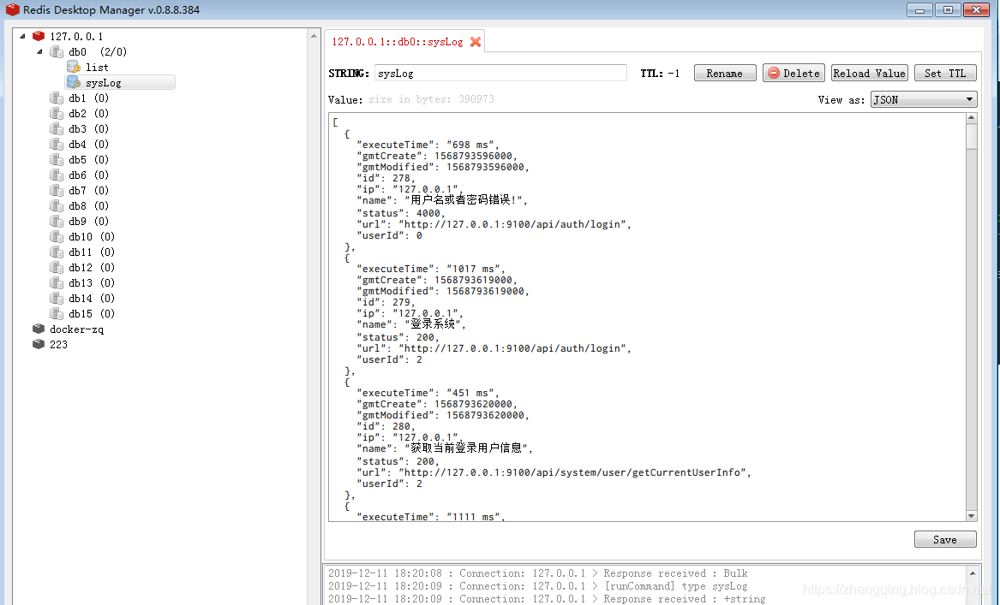

### 前言

本文将会基于 `springboot 2.1.8.RELEASE` 简单整合 `Redis` ，适合新手小白入门

### `Spring Boot` 整合 `Redis` 入门

#### 1、`pom.xml` 中引入 `redis` 依赖

```xml
<!-- Redis依赖 -->
<dependency>
    <groupId>org.springframework.boot</groupId>
    <artifactId>spring-boot-starter-data-redis</artifactId>
</dependency>
```

#### 2、`application.yml` 配置文件中配置Redis连接参数等

```yml
spring:
  # Redis数据源
  redis:
    # Redis数据库索引（默认为0）
    database: 0
    # Redis服务器地址
    host: 127.0.0.1
    # Redis服务器连接端口
    port: 6379
    # 连接超时时间（毫秒
    timeout: 6000
    # Redis服务器连接密码（默认为空）
    password:
    jedis:
      pool:
        max-active: 1000  # 连接池最大连接数（使用负值表示没有限制）
        max-wait: -1      # 连接池最大阻塞等待时间（使用负值表示没有限制）
        max-idle: 10      # 连接池中的最大空闲连接
        min-idle: 5       # 连接池中的最小空闲连接
```

#### 3、Redis核心配置类

> **温馨小提示**： 在这里注意设置key和value的序列化方式，否则存到redis里的数据会乱码

```java
@Configuration
public class RedisConfig {

    @Bean
    @SuppressWarnings("all")
    public RedisTemplate<String, Object> redisTemplate(RedisConnectionFactory factory) {
        RedisTemplate<String, Object> template = new RedisTemplate<String, Object>();
        template.setConnectionFactory(factory);
        Jackson2JsonRedisSerializer jackson2JsonRedisSerializer = new Jackson2JsonRedisSerializer(Object.class);
        ObjectMapper om = new ObjectMapper();
        om.setVisibility(PropertyAccessor.ALL, JsonAutoDetect.Visibility.ANY);
        om.enableDefaultTyping(ObjectMapper.DefaultTyping.NON_FINAL);
        jackson2JsonRedisSerializer.setObjectMapper(om);
        StringRedisSerializer stringRedisSerializer = new StringRedisSerializer();
        // key采用String的序列化方式
        template.setKeySerializer(stringRedisSerializer);
        // hash的key也采用String的序列化方式
        template.setHashKeySerializer(stringRedisSerializer);
        // value序列化方式采用jackson
        template.setValueSerializer(jackson2JsonRedisSerializer);
        // hash的value序列化方式采用jackson
        template.setHashValueSerializer(jackson2JsonRedisSerializer);
        template.afterPropertiesSet();
        return template;
    }

}
```

#### 4、简单测试

```java
@RestController
@RequestMapping("/api")
@Api(description = "测试-接口")
public class IndexController extends BaseController {

    private final String key = "sysLog";
    
    @Autowired
    private ILogService logService;
    
    @Autowired
    RedisTemplate redisTemplate;

    @PostMapping(value = "/saveData", produces = "application/json;charset=utf-8")
    @ApiOperation(value = "保存数据", httpMethod = "POST", response = ApiResult.class)
    public ApiResult saveData(@RequestBody SysLog sysLog) {
        List<SysLog> sysLogList = logService.selectList(null);
        redisTemplate.opsForValue().set(key, sysLogList);
        return ApiResult.ok("SUCCESS");
    }

    @GetMapping(value = "/getData", produces = "application/json;charset=utf-8")
    @ApiOperation(value = "获取数据", httpMethod = "GET", response = ApiResult.class)
    public ApiResult getData() {
        List<SysLog> result = (List<SysLog>) redisTemplate.opsForValue().get(key);
        return ApiResult.ok("SUCCESS", result);
    }

}
```



### 本文案例demo源码

> **温馨小提示**：demo源码中含Redis工具类，可视化工具，windows版redis

[https://gitee.com/zhengqingya/java-workspace](https://gitee.com/zhengqingya/java-workspace)
