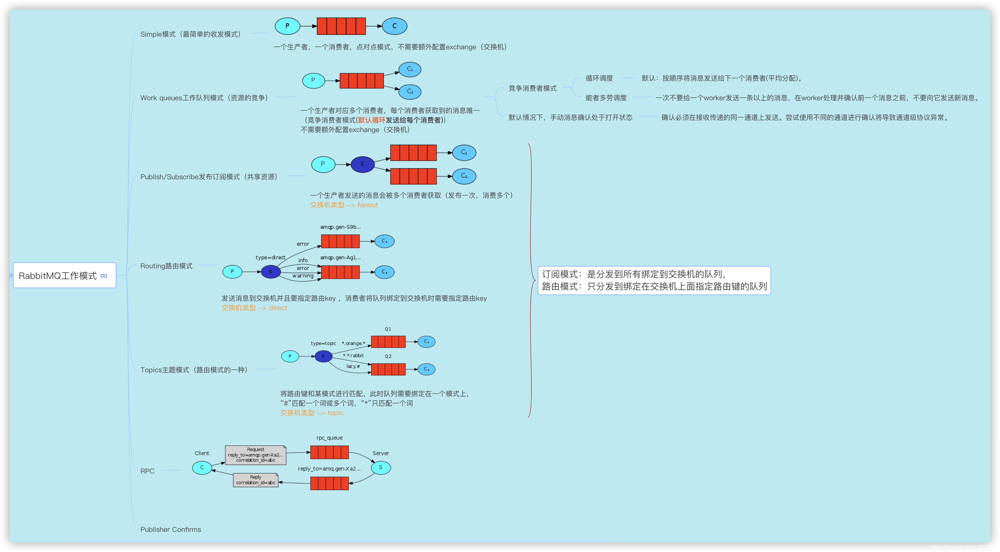
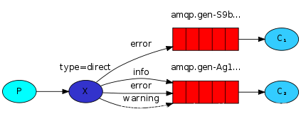
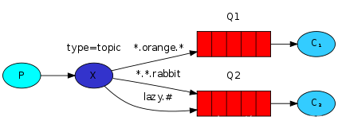
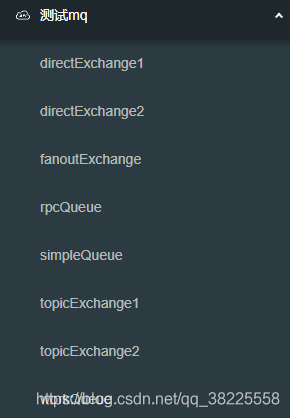
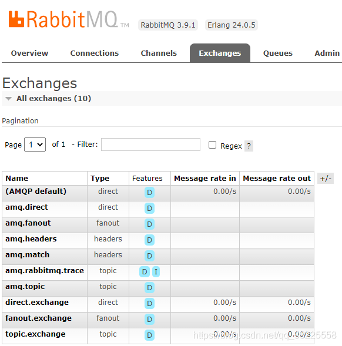
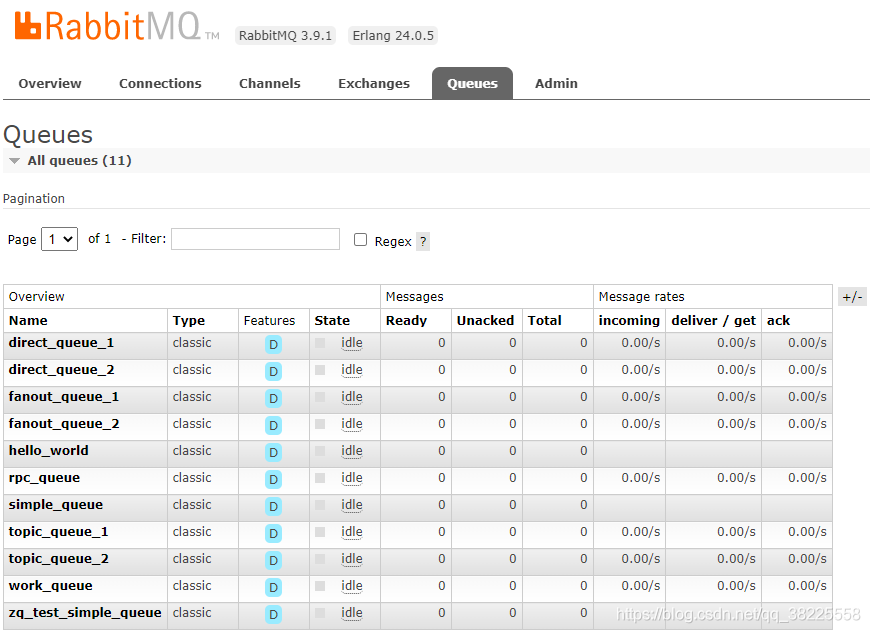

@[TOC](文章目录)

### 一、前言

SpringBoot整合RabbitMQ可参考：[https://zhengqing.blog.csdn.net/article/details/103785041](https://zhengqing.blog.csdn.net/article/details/103785041)
本文将基于`springboot2.4.0`来简单编写`rabbitmq`的7种工作模式demo `^_^`


### 二、RabbitMQ 7种工作模式

> 可参考：[https://www.rabbitmq.com/getstarted.html](https://www.rabbitmq.com/getstarted.html)

工程如下：


MQ全局常用变量

```java
public interface MqConstant {

    /**
     * 简单模式
     */
    String SIMPLE_QUEUE = "simple_queue";
    /**
     * 工作队列模式
     */
    String WORK_QUEUE = "work_queue";
    /**
     * 发布订阅模式
     */
    String FANOUT_EXCHANGE = "fanout.exchange";
    String FANOUT_QUEUE_1 = "fanout_queue_1";
    String FANOUT_QUEUE_2 = "fanout_queue_2";
    /**
     * 路由模式
     */
    String DIRECT_EXCHANGE = "direct.exchange";
    String DIRECT_QUEUE_1 = "direct_queue_1";
    String DIRECT_QUEUE_2 = "direct_queue_2";
    /**
     * 通配符模式
     */
    String TOPIC_EXCHANGE = "topic.exchange";
    String TOPIC_QUEUE_1 = "topic_queue_1";
    String TOPIC_QUEUE_2 = "topic_queue_2";
    /**
     * RPC模式
     */
    String RPC_QUEUE = "rpc_queue";

}
```

#### 1、简单模式


```java
@Configuration
public class SimpleRabbitMqConfig {

    @Bean
    public Queue simpleQueue() {
        // durable: true 标识开启消息队列持久化 (队列当中的消息在重启rabbitmq服务的时候还会存在)
        return new Queue(MqConstant.SIMPLE_QUEUE, true);
    }

}
```

```java
@Slf4j
@Component
public class SimpleMsgProducer {

    @Autowired
    private AmqpTemplate rabbitTemplate;

    public void send() {
        String msgContent = "Hello World";
        log.info("[生产者] 发送消息: {}", msgContent);
        this.rabbitTemplate.convertAndSend(MqConstant.SIMPLE_QUEUE, msgContent);
    }

}
```

```java
@Slf4j
@Component
public class SimpleMsgConsumer {

    @RabbitListener(queues = MqConstant.SIMPLE_QUEUE)
    public void listener(String msg) {
        log.info("[消费者] 接收消息: {}", msg);
    }

}
```

#### 2、工作队列模式


```java
@Configuration
public class WorkRabbitMqConfig {

    @Bean
    public Queue workQueue() {
        // durable: true 标识开启消息队列持久化 (队列当中的消息在重启rabbitmq服务的时候还会存在)
        return new Queue(MqConstant.WORK_QUEUE, true);
    }

}
```

```java
@Slf4j
@Component
public class WorkMsgProducer {

    @Autowired
    private AmqpTemplate rabbitTemplate;

    public void send() {
        String msgContent = "Hello World";
        log.info("[生产者] 发送消息: {}", msgContent);
        this.rabbitTemplate.convertAndSend(MqConstant.WORK_QUEUE, msgContent);
    }

}
```

```java
@Slf4j
@Component
public class WorkMsgConsumer {

    @RabbitListener(queues = MqConstant.WORK_QUEUE)
    public void listener1(String msg) {
        log.info("[消费者1] 接收消息: {}", msg);
    }

    @RabbitListener(queues = MqConstant.WORK_QUEUE)
    public void listener2(String msg) {
        log.info("[消费者2] 接收消息: {}", msg);
    }

}
```

#### 3、发布订阅模式


```java
@Configuration
public class FanoutRabbitMqConfig {

    /**
     * 配置交换器
     */
    @Bean
    public FanoutExchange fanoutExchange() {
        return new FanoutExchange(MqConstant.FANOUT_EXCHANGE);
    }

    /**
     * 配置队列
     */
    @Bean
    public Queue fanoutQueue1() {
        return new Queue(MqConstant.FANOUT_QUEUE_1, true, false, false, null);
    }

    @Bean
    public Queue fanoutQueue2() {
        return new Queue(MqConstant.FANOUT_QUEUE_2, true, false, false, null);
    }

    /**
     * 配置绑定
     */
    @Bean
    public Binding fanoutBinding1(FanoutExchange fanoutExchange, Queue fanoutQueue1) {
        return BindingBuilder.bind(fanoutQueue1).to(fanoutExchange);
    }

    @Bean
    public Binding fanoutBinding2(FanoutExchange fanoutExchange, Queue fanoutQueue2) {
        return BindingBuilder.bind(fanoutQueue2).to(fanoutExchange);
    }

}
```

```java
@Slf4j
@Component
public class FanoutMsgProducer {

    @Autowired
    private AmqpTemplate rabbitTemplate;

    public void send() {
        String msgContent = "Hello World";
        log.info("[生产者] 发送消息: {}", msgContent);
        this.rabbitTemplate.convertAndSend(MqConstant.FANOUT_EXCHANGE, "", msgContent);
    }

}
```

```java
@Slf4j
@Component
public class FanoutMsgConsumer {

    @RabbitListener(queues = MqConstant.FANOUT_QUEUE_1)
    public void listener1(String msg) {
        log.info("[消费者1] 接收消息: {}", msg);
    }

    @RabbitListener(queues = MqConstant.FANOUT_QUEUE_2)
    public void listener2(String msg) {
        log.info("[消费者2] 接收消息: {}", msg);
    }

}
```

#### 4、路由模式




```java
@Configuration
public class DirectRabbitMqConfig {

    /**
     * 配置交换机
     */
    @Bean
    public DirectExchange directExchange() {
        return new DirectExchange(MqConstant.DIRECT_EXCHANGE);
    }

    /**
     * 配置队列
     */
    @Bean
    public Queue directQueue1() {
        return new Queue(MqConstant.DIRECT_QUEUE_1, true, false, false, null);
    }

    @Bean
    public Queue directQueue2() {
        return new Queue(MqConstant.DIRECT_QUEUE_2, true, false, false, null);
    }

    /**
     * 配置绑定
     */
    @Bean
    public Binding directBinding1(Queue directQueue1, DirectExchange directExchange) {
        return BindingBuilder.bind(directQueue1).to(directExchange).with("one");
    }

    @Bean
    public Binding directBinding2(Queue directQueue2, DirectExchange directExchange) {
        return BindingBuilder.bind(directQueue2).to(directExchange).with("two");
    }

}
```

```java
@Slf4j
@Component
public class DirectMsgProducer {

    @Autowired
    private AmqpTemplate rabbitTemplate;

    public void send1() {
        String msgContent = "Hello World";
        log.info("[生产者1] 发送消息: {}", msgContent);
        this.rabbitTemplate.convertAndSend(MqConstant.DIRECT_EXCHANGE, "one", msgContent);
    }

    public void send2() {
        String msgContent = "Hello World";
        log.info("[生产者2] 发送消息: {}", msgContent);
        this.rabbitTemplate.convertAndSend(MqConstant.DIRECT_EXCHANGE, "two", msgContent);
    }

}
```

```java
@Slf4j
@Component
public class DirectMsgConsumer {

    /**
     * @RabbitListener 具有监听指定队列、指定exchange、指定routingKey的消息
     * 和建立队列、exchange、routingKey的功能
     */
    @RabbitListener(
            bindings = @QueueBinding(
                    value = @Queue(value = MqConstant.DIRECT_QUEUE_1, durable = "true"),
                    exchange = @Exchange(value = MqConstant.DIRECT_EXCHANGE, type = "direct", durable = "true"),
                    key = "one"
            ))
//    @RabbitListener(queues = MqConstant.DIRECT_QUEUE_1)
    public void listener1(String msg) {
        log.info("[消费者1] 接收消息: {}", msg);
    }

    @RabbitListener(
            bindings = @QueueBinding(
                    value = @Queue(value = MqConstant.DIRECT_QUEUE_2, durable = "true"),
                    exchange = @Exchange(value = MqConstant.DIRECT_EXCHANGE, type = "direct", durable = "true"),
                    key = "two"
            ))
    //    @RabbitListener(queues = MqConstant.DIRECT_QUEUE_2)
    public void listener2(String msg) {
        log.info("[消费者2] 接收消息: {}", msg);
    }

}
```

#### 5、主题模式(通配符模式)




```java
@Configuration
public class TopicRabbitMqConfig {

    /**
     * 配置交换器
     */
    @Bean
    public TopicExchange topicExchange() {
        return new TopicExchange(MqConstant.TOPIC_EXCHANGE);
    }

    /**
     * 配置队列
     */
    @Bean
    public Queue topicQueue1() {
        return new Queue(MqConstant.TOPIC_QUEUE_1);
    }

    @Bean
    public Queue topicQueue2() {
        return new Queue(MqConstant.TOPIC_QUEUE_2);
    }

    /**
     * 配置绑定
     */
    @Bean
    public Binding topicBinding1(Queue topicQueue1, TopicExchange topicExchange) {
        // *：只能匹配一个词
        return BindingBuilder.bind(topicQueue1).to(topicExchange).with("topic.*");
    }

    @Bean
    public Binding topicBinding2(Queue topicQueue2, TopicExchange topicExchange) {
        // #：可匹配多个词
        return BindingBuilder.bind(topicQueue2).to(topicExchange).with("topic.#");
    }

}
```

```java
@Slf4j
@Component
public class TopicMsgProducer {

    @Autowired
    private AmqpTemplate rabbitTemplate;

    public void send1() {
        String msgContent = "Hello World";
        log.info("[生产者1] 发送消息: {}", msgContent);
        this.rabbitTemplate.convertAndSend(MqConstant.TOPIC_EXCHANGE, "topic.one", msgContent);
    }

    public void send2() {
        String msgContent = "Hello World";
        log.info("[生产者2] 发送消息: {}", msgContent);
        this.rabbitTemplate.convertAndSend(MqConstant.TOPIC_EXCHANGE, "topic.one.two", msgContent);
    }

}
```

```java
@Slf4j
@Component
public class TopicMsgConsumer {

    @RabbitListener(queues = MqConstant.TOPIC_QUEUE_1)
    public void listener1(String msg) {
        log.info("[消费者1] 接收消息: {}", msg);
    }

    @RabbitListener(queues = MqConstant.TOPIC_QUEUE_2)
    public void listener2(String msg) {
        log.info("[消费者2] 接收消息: {}", msg);
    }

}
```

#### 6、RPC模式


```java
@Configuration
public class RpcRabbitMqConfig {

    @Bean
    public Queue rpcQueue() {
        return new Queue(MqConstant.RPC_QUEUE);
    }

}
```

```java
@Slf4j
@Component
public class RpcMsgProducer {

    @Autowired
    private AmqpTemplate rabbitTemplate;

    public void send() {
        String msgContent = "Hello World";
        log.info("[生产者] 发送消息: {}", msgContent);
        Object msgObj = this.rabbitTemplate.convertSendAndReceive(MqConstant.RPC_QUEUE, msgContent);
        log.info("[生产者] 接收回应：{}", msgObj);
    }

}
```

```java
@Slf4j
@Component
public class RpcMsgConsumer {

    @RabbitListener(queues = MqConstant.RPC_QUEUE)
    public String listener(String msg) {
        log.info("[消费者] 接收消息: {}", msg);
        return "消费者back";
    }

}
```

#### 7、Publisher Confirms

> 自己看官方文档吧...


### 三、测试api

编写controller，自己玩吧`^_^`

```java
@Api(tags = "测试mq")
@RestController
@RequestMapping("/mq")
public class RabbitController {

    @Autowired
    private SimpleMsgProducer simpleMsgProducer;

    @Autowired
    private WorkMsgProducer workMsgProducer;

    @Autowired
    private FanoutMsgProducer fanoutMsgProducer;

    @Autowired
    private DirectMsgProducer directMsgProducer;

    @Autowired
    private TopicMsgProducer topicMsgProducer;

    @Autowired
    private RpcMsgProducer rpcMsgProducer;

    @ApiOperation("simpleQueue")
    @PostMapping("simpleQueue")
    public String simpleQueue() {
        this.simpleMsgProducer.send();
        return "SUCCESS";
    }

    @ApiOperation("workQueue")
    @PostMapping("workQueue")
    public String workQueue() {
        this.workMsgProducer.send();
        return "SUCCESS";
    }

    @ApiOperation("fanoutExchange")
    @PostMapping("fanoutExchange")
    public String fanoutExchange() {
        this.fanoutMsgProducer.send();
        return "SUCCESS";
    }

    @ApiOperation("directExchange1")
    @PostMapping("directExchange1")
    public String directExchange1() {
        this.directMsgProducer.send1();
        return "SUCCESS";
    }

    @ApiOperation("directExchange2")
    @PostMapping("directExchange2")
    public String directExchange2() {
        this.directMsgProducer.send2();
        return "SUCCESS";
    }

    @ApiOperation("topicExchange1")
    @PostMapping("topicExchange1")
    public String topicExchange1() {
        this.topicMsgProducer.send1();
        return "SUCCESS";
    }

    @ApiOperation("topicExchange2")
    @PostMapping("topicExchange2")
    public String topicExchange2() {
        this.topicMsgProducer.send2();
        return "SUCCESS";
    }

    @ApiOperation("rpcQueue")
    @PostMapping("rpcQueue")
    public String rpcQueue() {
        this.rpcMsgProducer.send();
        return "SUCCESS";
    }

}
```

接口文档： [http://127.0.0.1/doc.html](http://127.0.0.1/doc.html)

RabbitMQ




### 四、本文案例demo源码

[https://gitee.com/zhengqingya/java-workspace](https://gitee.com/zhengqingya/java-workspace)


---

> 今日分享语句：
> 要想赢，就一定不能怕输。不怕输，结果未必能赢。但是怕输，结果则一定是输。

