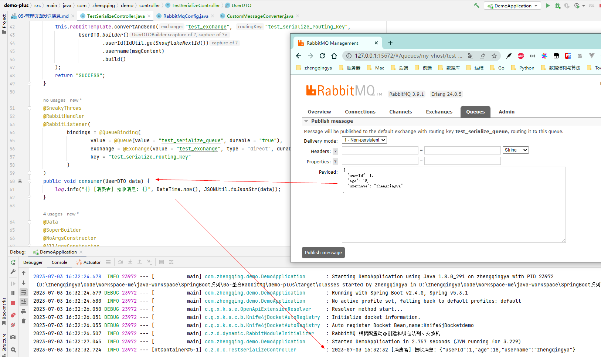

# 管理页面发送消息

```json
{
  "userId": 1,
  "age": 18,
  "username": "zhengqingya"
}
```

### 1、接收String消息

直接在管理页面中的队列详情中进行发送消息即可...


### 2、接收对象消息

默认只能接收String类型消息数据


> tips: 下面是网上说的配置，经尝试无效
> 1. 在 `Headers` 中添加
> - key:`typeId`, value:`com.zhengqing.demo.rabbitmq.simple.SimpleMsgConsumer.UserBO`
> 2. 在 `Properties` 中添加
> - key:`content_type`, value:`text/json`
> - key:`content_encoding`, value:`UTF-8`

如果想要接收对象数据，可以在消费者配置Json消息转换器

```java
package com.zhengqing.demo.config;

import org.springframework.amqp.rabbit.config.SimpleRabbitListenerContainerFactory;
import org.springframework.amqp.rabbit.connection.ConnectionFactory;
import org.springframework.amqp.support.converter.Jackson2JsonMessageConverter;
import org.springframework.context.annotation.Bean;
import org.springframework.context.annotation.Configuration;

@Configuration
public class RabbitMqConfig {
    /**
     * 消费者配置
     */
    @Bean
    public SimpleRabbitListenerContainerFactory rabbitListenerContainerFactory(ConnectionFactory connectionFactory) {
        SimpleRabbitListenerContainerFactory factory = new SimpleRabbitListenerContainerFactory();
        factory.setConnectionFactory(connectionFactory);
        /**
         * 配置JSON消息转换器
         * rabbitmq默认的消息转换器 {@link org.springframework.amqp.support.converter.SimpleMessageConverter}
         */
        factory.setMessageConverter(new Jackson2JsonMessageConverter());
        return factory;
    }
}
```

接收对象消息


---

tips: 也可在生产者和消费者配置自定义消息转换器；
见[自定义消息转换器优化序列化问题](../06-SpringBoot集成实战/07-自定义消息转换器优化序列化问题.md)

