# Kafka 消费者

### 一、Kafka 消费方式

1. pull（拉）模式：
   consumer采用从broker中主动拉取数据。Kafka采用这种方式。
2. push（推）模式：
   Kafka没有采用这种方式，因为由broker决定消息发送速率，很难适应所有消费者的消费速率。例如推送的速度是50m/s，Consumer1、Consumer2就来不及处理消息。
   pull模式不足之处是，如果Kafka没有数据，消费者可能会陷入循环中，一直返回空数据。

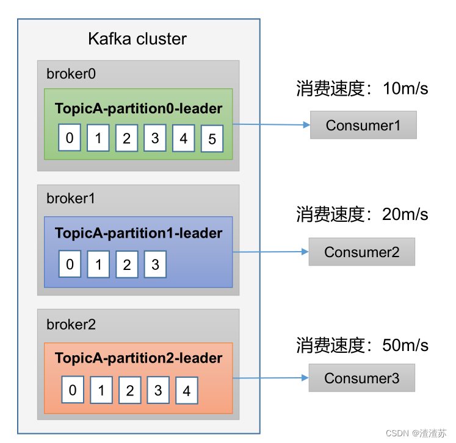

### 二、Kafka 消费者工作流程

#### 1、消费者总体工作流程

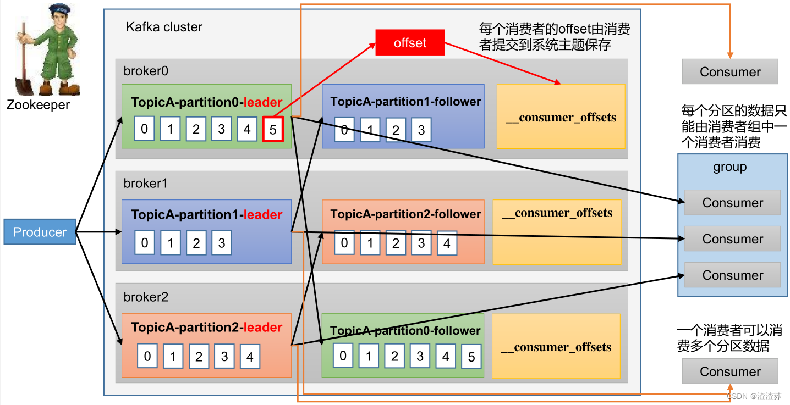

#### 2、消费者组原理

Consumer Group（CG）：消费者组，由多个consumer组成。形成一个消费者组的条件，是所有消费者的groupid相同。

- 消费者组内每个消费者负责消费不同分区的数据，一个分区只能由一个组内消费者消费。
- 消费者组之间互不影响。所有的消费者都属于某个消费者组，即消费者组是逻辑上的一个订阅者。


coordinator：辅助实现消费者组的初始化和分区的分配。
coordinator节点选择 = groupid的hashcode值 % 50（__consumer_offsets的分区数量）

eg： groupid的hashcode值 = 1， 1% 50 = 1，那么 __consumer_offsets 主题的1号分区，
在哪个broker上，就选择这个节点的coordinator作为这个消费者组的老大。消费者组下的所有的消费者提交offset的时候就往这个分区去提交offset。


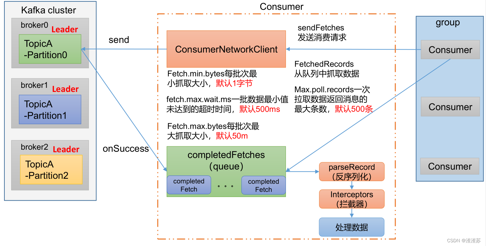

#### 3、消费者重要参数

| 参数名称                                 | 描述                                                                                                                                                                                |
|--------------------------------------|-----------------------------------------------------------------------------------------------------------------------------------------------------------------------------------|
| bootstrap.servers                    | 向 Kafka 集群建立初始连接用到的 host/port 列表。                                                                                                                                                 |
| key.deserializer和 value.deserializer | 指定接收消息的 key 和 value 的反序列化类型。一定要写全类名。                                                                                                                                              |
| group.id                             | 标记消费者所属的消费者组。                                                                                                                                                                     |
| enable.auto.commit                   | 默认值为 true，消费者会自动周期性地向服务器提交偏移量。                                                                                                                                                    |
| auto.commit.interval.ms              | 如果设置了 enable.auto.commit 的值为 true， 则该值定义了 消费者偏移量向 Kafka 提交的频率，默认 5s。                                                                                                              |
| auto.offset.reset                    | 当 Kafka 中没有初始偏移量或当前偏移量在服务器中不存在 （如，数据被删除了），该如何处理？ earliest：自动重置偏 移量到最早的偏移量。 latest：默认，自动重置偏移量为最 新的偏移量。 none：如果消费组原来的（previous）偏移量 不存在，则向消费者抛异常。 anything：向消费者抛异常。                  |
| offsets.topic.num.partitions         | __consumer_offsets 的分区数，默认是 50 个分区。                                                                                                                                               |
| heartbeat.interval.ms                | Kafka 消费者和 coordinator 之间的心跳时间，默认 3s。 该条目的值必须小于 session.timeout.ms ，也不应该高于 session.timeout.ms 的 1/3。                                                                              |
| session.timeout.ms                   | Kafka 消费者和 coordinator 之间连接超时时间，默认 45s。 超过该值，该消费者被移除，消费者组执行再平衡。                                                                                                                   |
| max.poll.interval.ms                 | 消费者处理消息的最大时长，默认是 5 分钟。超过该值，该 消费者被移除，消费者组执行再平衡。                                                                                                                                    |
| fetch.min.bytes                      | 默认 1 个字节。消费者获取服务器端一批消息最小的字节数。                                                                                                                                                     |
| fetch.max.wait.ms                    | 默认 500ms。如果没有从服务器端获取到一批数据的最小字 节数。该时间到，仍然会返回数据。                                                                                                                                    |
| fetch.max.bytes                      | 默认 Default: 52428800（50 m）。消费者获取服务器端一批 消息最大的字节数。如果服务器端一批次的数据大于该值 （50m）仍然可以拉取回来这批数据，因此，这不是一个绝 对最大值。一批次的大小受 message.max.bytes （broker config）or max.message.bytes （topic config）影响。 |
| max.poll.records                     | 一次 poll 拉取数据返回消息的最大条数，默认是 500 条。                                                                                                                                                  |

### 三、消费者 API

#### 1、独立消费者案例（订阅主题）

需求：创建一个独立消费者，消费 first 主题中数据。

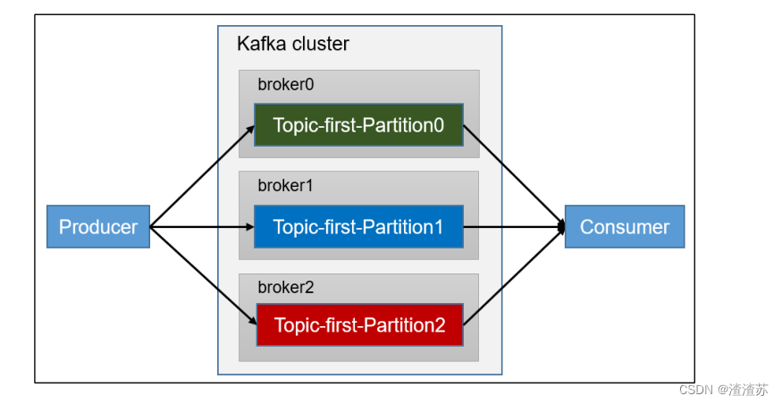

> 注意：在消费者 API 代码中必须配置消费者组 id。命令行启动消费者不填写消费者组id 会被自动填写随机的消费者组 id。

创建主题

```shell
docker exec -it kafka-1 /opt/bitnami/kafka/bin/kafka-topics.sh --create --bootstrap-server kafka-1:9092 --topic first --partitions 3 --replication-factor 2
```

编写java程序

```java
package com.zhengqing.demo.consumer;

import com.google.common.collect.Lists;
import org.apache.kafka.clients.consumer.ConsumerConfig;
import org.apache.kafka.clients.consumer.ConsumerRecord;
import org.apache.kafka.clients.consumer.ConsumerRecords;
import org.apache.kafka.clients.consumer.KafkaConsumer;
import org.apache.kafka.common.serialization.StringDeserializer;
import org.junit.Test;
import org.springframework.boot.logging.LogLevel;
import org.springframework.boot.logging.LoggingSystem;

import java.time.Duration;
import java.util.ArrayList;
import java.util.Properties;

public class KafkaConsumerTest_01 {
    @Test
    public void test() throws Exception {
        this.updateLogLevel();
        // 创建消费者的配置对象
        Properties properties = new Properties();
        // 给消费者配置对象添加参数
        properties.put(ConsumerConfig.BOOTSTRAP_SERVERS_CONFIG, "127.0.0.1:9093");
        // 配置序列化 必须
        properties.put(ConsumerConfig.KEY_DESERIALIZER_CLASS_CONFIG, StringDeserializer.class.getName());
        properties.put(ConsumerConfig.VALUE_DESERIALIZER_CLASS_CONFIG, StringDeserializer.class.getName());
        // 配置消费者组（组名任意起名） 必须
        properties.put(ConsumerConfig.GROUP_ID_CONFIG, "test");
        // 创建消费者对象
        KafkaConsumer<String, String> kafkaConsumer = new KafkaConsumer<String, String>(properties);
        // 注册要消费的主题（可以消费多个主题）
        ArrayList<String> topics = Lists.newArrayList("first");
        kafkaConsumer.subscribe(topics);
        // 拉取数据打印
        while (true) {
            // 设置 1s 中消费一批数据
            ConsumerRecords<String, String> consumerRecords = kafkaConsumer.poll(Duration.ofSeconds(1));
            // 打印消费到的数据
            for (ConsumerRecord<String, String> consumerRecord : consumerRecords) {
                System.out.println(consumerRecord);
            }
        }
    }

    private void updateLogLevel() {
        LoggingSystem loggingSystem = LoggingSystem.get(LoggingSystem.class.getClassLoader());
        loggingSystem.setLogLevel("org.apache.kafka", LogLevel.WARN);
    }
}
```

控制台生产者发送消息

```shell
docker exec -it kafka-1 /opt/bitnami/kafka/bin/kafka-console-producer.sh --bootstrap-server kafka-1:9092 --topic first
```

java程序接收消息日志

```shell
ConsumerRecord(topic = first, partition = 0, leaderEpoch = 0, offset = 0, CreateTime = 1688549354005, serialized key size = -1, serialized value size = 5, headers = RecordHeaders(headers = [], isReadOnly = false), key = null, value = hello)
```

#### 2、独立消费者案例（订阅分区）

需求：创建一个独立消费者，消费 first 主题 0 号分区的数据。
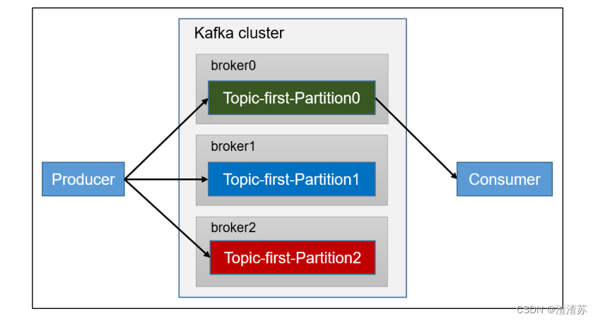

```java
package com.zhengqing.demo.consumer;

import com.google.common.collect.Lists;
import org.apache.kafka.clients.consumer.ConsumerConfig;
import org.apache.kafka.clients.consumer.ConsumerRecord;
import org.apache.kafka.clients.consumer.ConsumerRecords;
import org.apache.kafka.clients.consumer.KafkaConsumer;
import org.apache.kafka.common.TopicPartition;
import org.apache.kafka.common.serialization.StringDeserializer;
import org.junit.Test;
import org.springframework.boot.logging.LogLevel;
import org.springframework.boot.logging.LoggingSystem;

import java.time.Duration;
import java.util.ArrayList;
import java.util.Properties;

public class KafkaConsumerTest_02 {
    @Test
    public void test() throws Exception {
        this.updateLogLevel();
        // 创建消费者的配置对象
        Properties properties = new Properties();
        // 给消费者配置对象添加参数
        properties.put(ConsumerConfig.BOOTSTRAP_SERVERS_CONFIG, "127.0.0.1:9093");
        // 配置序列化 必须
        properties.put(ConsumerConfig.KEY_DESERIALIZER_CLASS_CONFIG, StringDeserializer.class.getName());
        properties.put(ConsumerConfig.VALUE_DESERIALIZER_CLASS_CONFIG, StringDeserializer.class.getName());
        // 配置消费者组（组名任意起名） 必须
        properties.put(ConsumerConfig.GROUP_ID_CONFIG, "test");
        // 创建消费者对象
        KafkaConsumer<String, String> kafkaConsumer = new KafkaConsumer<String, String>(properties);
        // 消费某个主题的某个分区数据
        ArrayList<TopicPartition> topicPartitions = Lists.newArrayList(
                new TopicPartition("first", 0)
        );
        kafkaConsumer.assign(topicPartitions);
        // 拉取数据打印
        while (true) {
            ConsumerRecords<String, String> consumerRecords = kafkaConsumer.poll(Duration.ofSeconds(1));
            for (ConsumerRecord<String, String> consumerRecord : consumerRecords) {
                System.out.println(consumerRecord);
            }
        }
    }

    private void updateLogLevel() {
        LoggingSystem loggingSystem = LoggingSystem.get(LoggingSystem.class.getClassLoader());
        loggingSystem.setLogLevel("org.apache.kafka", LogLevel.WARN);
    }
}
```

#### 3、消费者组案例

需求：测试同一个主题的分区数据，只能由一个消费者组中的一个消费。
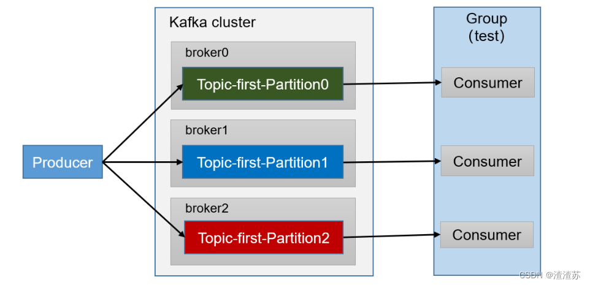

cv一个消费者 & 运行多个消费者进行测试即可...

### 四、生产经验 -- 分区的分配以及再平衡

1. 一个consumer group中有多个consumer组成，一个 topic有多个partition组成，现在的问题是，到底由哪个consumer来消费哪个partition的数据。
2. Kafka有四种主流的分区分配策略： `Range`、`RoundRobin`、`Sticky`、`CooperativeSticky`。
   可以通过配置参数partition.assignment.strategy，修改分区的分配策略。
   默认策略是`Range` + `CooperativeSticky`。
   Kafka可以同时使用多个分区分配策略。

| 参数名称                          | 描述                                                                                                                 |
|-------------------------------|--------------------------------------------------------------------------------------------------------------------|
| heartbeat.interval.ms         | Kafka 消费者和 coordinator 之间的心跳时间，默认 3s。该条目的值必须小于 session.timeout.ms，也不应该高于  session.timeout.ms 的 1/3。                |
| session.timeout.ms            | Kafka 消费者和 coordinator 之间连接超时时间，默认 45s。超  过该值，该消费者被移除，消费者组执行再平衡。                                                   |
| max.poll.interval.ms          | 消费者处理消息的最大时长，默认是 5 分钟。超过该值，该  消费者被移除，消费者组执行再平衡。                                                                    |
| partition.assignment.strategy | 消费者分区分配策略， 默认策略是Range +CooperativeSticky。Kafka可以同时使用多个分区分配策略。可以选择的策略包括 ： Range、RoundRobin、Sticky、CooperativeSticky |

#### 1、Range 以及再平衡

Range 是对每个 topic 而言的。

首先对同一个 topic 里面的分区按照序号进行排序，并对消费者按照字母顺序进行排序。
假如现在有7个分区，3个消费者，排序后的分区将会是0,1,2,3,4,5,6；消费者排序完之后将会是C0,C1,C2。

例如，7/3 = 2 余 1 ，除不尽，那么 消费者 C0 便会多消费 1 个分区。 8/3=2余2，除不尽，那么C0和C1分别多消费一个。

通过 partitions数/consumer数 来决定每个消费者应该消费几个分区。如果除不尽，那么前面几个消费者将会多消费 1 个分区。

> 注意：如果只是针对 1 个 topic 而言，C0消费者多消费1个分区影响不是很大。但是如果有 N 多个 topic，那么针对每个 topic，
> 消费者C0都将多消费 1 个分区，topic越多，C0消费的分区会比其他消费者明显多消费 N 个分区。

容易产生数据倾斜！


##### a: Range 分区分配策略案例

1. 修改主题 first 为 7 个分区。

```shell
docker exec -it kafka-1 /opt/bitnami/kafka/bin/kafka-topics.sh --bootstrap-server kafka-1:9092 --alter --topic first --partitions 7
```

    > 注意：分区数可以增加，但是不能减少。

2. 准备3个消费者 & 组名都为“test” & 同时启动。
   > 说明：Kafka 默认的分区分配策略就是 Range + CooperativeSticky，所以不需要修改策略。
3. 启动生产者，发送消息，随机发送到不同的分区。
4. 观看 3 个消费者分别消费哪些分区的数据。
   

##### b: Range 分区分配再平衡案例

1. 停止掉 0 号消费者，快速重新发送消息观看结果（45s 以内，越快越好）。
    - 1 号消费者：消费到 3、4 号分区数据。
    - 2 号消费者：消费到 5、6 号分区数据。
    - 0 号消费者的任务会整体被分配到 1 号消费者或者 2 号消费者。
   > 说明：0号消费者挂掉后，消费者组需要按照超时时间45s来判断它是否退出，所以需要等待，时间到了45s后，判断它真的退出就会把任务分配给其他broker执行。
2. 再次重新发送消息观看结果（45s 以后）。
    - 1 号消费者：消费到 0、1、2、3 号分区数据。
    - 2 号消费者：消费到 4、5、6 号分区数据。
   > 说明：消费者 0 已经被踢出消费者组，所以重新按照 range 方式分配。

#### 2、RoundRobin 以及再平衡

##### a： RoundRobin 分区策略原理

RoundRobin 针对集群中所有Topic而言。

RoundRobin 轮询分区策略，是把所有的 partition 和所有的consumer 都列出来，然后按照 hashcode 进行排序，
最后通过轮询算法来分配 partition 给到各个消费者。
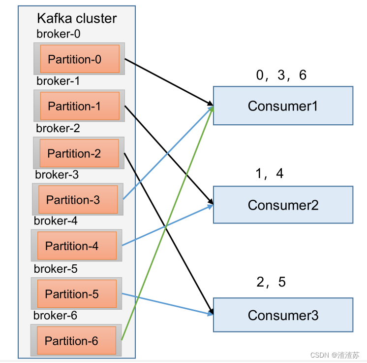

##### b： RoundRobin 分区分配策略案例

1. 依次在三个消费者代码中修改分区分配策略为 RoundRobin。

```
// 修改分区分配策略
properties.put(ConsumerConfig.PARTITION_ASSIGNMENT_STRATEGY_CONFIG, RoundRobinAssignor.class.getName());
```

2. 重启 3 个消费者，重复发送消息的步骤，观看分区结果。
   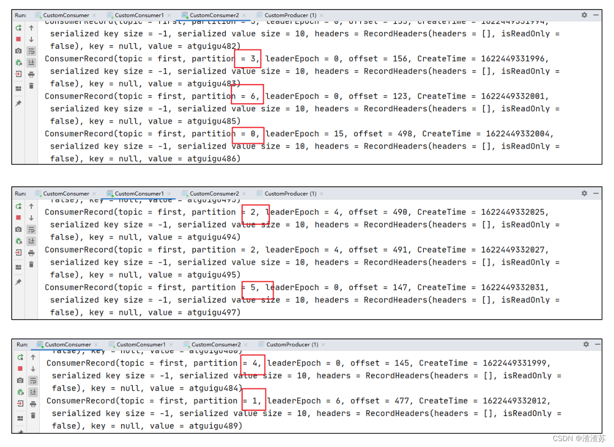

##### c： RoundRobin 分区分配再平衡案例

1. 停止掉 0 号消费者，快速重新发送消息观看结果（45s 以内，越快越好）。
    - 1 号消费者：消费到 2、5 号分区数据
    - 2 号消费者：消费到 4、1 号分区数据
    - 0 号消费者的任务会按照 RoundRobin 的方式，把数据轮询分成 0 、6 和 3 号分区数据，分别由 1 号消费者或者 2 号消费者消费。
   > 说明：0号消费者挂掉后，消费者组需要按照超时时间45s来判断它是否退出，所以需要等待，时间到了45s后，判断它真的退出就会把任务分配给其他broker执行。
2. 再次重新发送消息观看结果（45s 以后）。
    - 1 号消费者：消费到 0、2、4、6 号分区数据
    - 2 号消费者：消费到 1、3、5 号分区数据
   > 说明：消费者0已经被踢出消费者组，所以重新按照 RoundRobin 方式分配。

#### 3、Sticky 以及再平衡

##### a: 原理

粘性分区定义：可以理解为分配的结果带有“粘性的”。即在执行一次新的分配之前，考虑上一次分配的结果，尽量少的调整分配的变动，可以节省大量的开销。
粘性分区是 Kafka 从 0.11.x 版本开始引入这种分配策略，首先会尽量均衡的放置分区到消费者上面，在出现同一消费者组内消费者出现问题的时候，会尽量保持原有分配的分区不变化。

##### b：测试

需求: 设置主题为 first，7 个分区；准备 3 个消费者，采用粘性分区策略，并进行消费，观察消费分配情况。然后再停止其中一个消费者，再次观察消费分配情况。

> 注意：3 个消费者都应该注释掉，之后重启 3 个消费者，如果出现报错，全部停止等会再重启，或者修改为全新的消费者组。

修改代码

```
// 修改分区分配策略
List<String> startegys = Lists.newArrayList(
       StickyAssignor.class.getName()
);
properties.put(ConsumerConfig.PARTITION_ASSIGNMENT_STRATEGY_CONFIG, startegys);
```

使用生产者发送消息。

可以看到会尽量保持分区的个数近似划分分区。
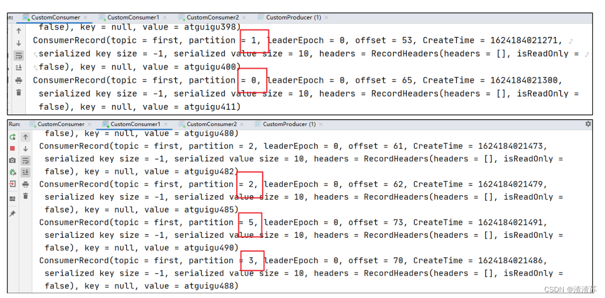

##### c：Sticky 分区分配再平衡案例

1. 停止掉0号消费者，快速重新发送消息观看结果（45s 以内，越快越好）。
    - 1 号消费者：消费到 2、5、3 号分区数据。
    - 2 号消费者：消费到 4、6 号分区数据。
    - 0 号消费者的任务会按照粘性规则，尽可能均衡的随机分成 0 和 1 号分区数据，分别由 1 号消费者或者 2 号消费者消费。
   > 说明：0 号消费者挂掉后，消费者组需要按照超时时间45s来判断它是否退出，所以需要等待，时间到了45s后，判断它真的退出就会把任务分配给其他broker执行。
2. 再次重新发送消息观看结果（45s 以后）。
    - 1 号消费者：消费到 2、3、5 号分区数据。
    - 2 号消费者：消费到 0、1、4、6 号分区数据。
   > 说明：消费者 0 已经被踢出消费者组，所以重新按照粘性方式分配。

### 五、offset 位移

#### 1、offset 的默认维护位置

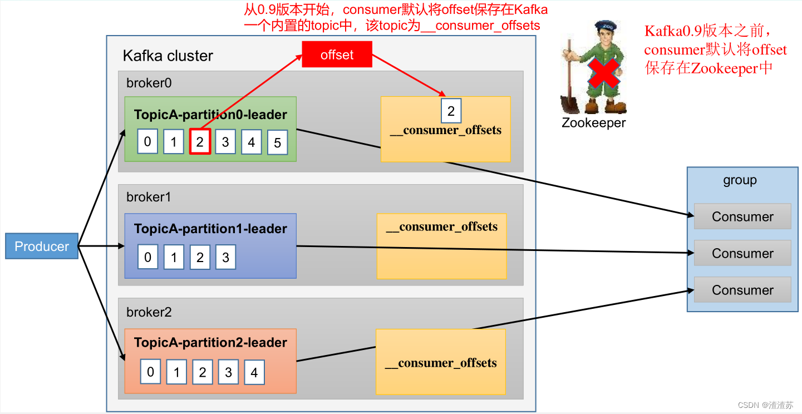

__consumer_offsets 主题里面采用 key 和 value 的方式存储数据。
key 是 group.id+topic+分区号，value 就是当前 offset 的值。
每隔一段时间，kafka 内部会对这个 topic 进行compact，也就是每个 group.id+topic+分区号就保留最新数据。

消费 offset 案例

1. 思想：__consumer_offsets 为 Kafka 中的 topic，那就可以通过消费者进行消费。
2. 在配置文件 config/consumer.properties 中添加配置 exclude.internal.topics=false，
   默认是 true，表示不能消费系统主题。为了查看该系统主题数据，所以该参数修改为 false。
3. 采用命令行方式，创建一个新的 topic。

```shell
docker exec -it kafka-1 /opt/bitnami/kafka/bin/kafka-topics.sh --create --bootstrap-server kafka-1:9092 --topic zhengqingya --partitions 3 --replication-factor 2
```

4. 启动生产者往 topic 生产数据。

```shell
docker exec -it kafka-1 /opt/bitnami/kafka/bin/kafka-console-producer.sh --bootstrap-server kafka-1:9092 --topic zhengqingya
```

5. 启动消费者消费 topic 数据。

```shell
docker exec -it kafka-1 /opt/bitnami/kafka/bin/kafka-console-consumer.sh --bootstrap-server kafka-1:9092 --topic zhengqingya --group test
```

注意：指定消费者组名称，更好观察数据存储位置（key 是 group.id+topic+分区号）。

6. 查看消费者消费主题

```shell
# tips: 这里docker中暂未看见相关配置文件，后期再测试看看
docker exec -it kafka-1 /opt/bitnami/kafka/bin/kafka-console-consumer.sh --topic __consumer_offsets --bootstrap-server kafka-1:9092 --consumer.config config/consumer.properties --formatter "kafka.coordinator.group.GroupMetadataManager\$OffsetsMessageForm atter" --from-beginning
```

#### 2、自动提交 offset

为了使我们能够专注于自己的业务逻辑，Kafka提供了自动提交offset的功能。

自动提交offset的相关参数：

- enable.auto.commit：是否开启自动提交offset功能，默认是true
- auto.commit.interval.ms：自动提交offset的时间间隔，默认是


| 参数名称                    | 描述                                                                  |
|-------------------------|---------------------------------------------------------------------|
| enable.auto.commit      | 默认值为 true，消费者会自动周期性地向服务器提交偏移量。                                      |
| auto.commit.interval.ms | 如果设置了 enable.auto.commit 的值为 true， 则该值定义了消费者偏移量向 Kafka 提交的频率，默认 5s。 |

1）消费者自动提交 offset

```java
package com.zhengqing.demo.consumer;

import com.google.common.collect.Lists;
import org.apache.kafka.clients.consumer.ConsumerConfig;
import org.apache.kafka.clients.consumer.ConsumerRecord;
import org.apache.kafka.clients.consumer.ConsumerRecords;
import org.apache.kafka.clients.consumer.KafkaConsumer;
import org.apache.kafka.common.serialization.StringDeserializer;
import org.junit.Test;
import org.springframework.boot.logging.LogLevel;
import org.springframework.boot.logging.LoggingSystem;

import java.time.Duration;
import java.util.Properties;

public class KafkaConsumerTest_05_AutoOffset {
    @Test
    public void test() throws Exception {
        this.updateLogLevel();
        // 创建消费者的配置对象
        Properties properties = new Properties();
        // 给消费者配置对象添加参数
        properties.put(ConsumerConfig.BOOTSTRAP_SERVERS_CONFIG, "127.0.0.1:9093");
        // 配置序列化 必须
        properties.put(ConsumerConfig.KEY_DESERIALIZER_CLASS_CONFIG, StringDeserializer.class.getName());
        properties.put(ConsumerConfig.VALUE_DESERIALIZER_CLASS_CONFIG, StringDeserializer.class.getName());
        // 配置消费者组（组名任意起名） 必须
        properties.put(ConsumerConfig.GROUP_ID_CONFIG, "test");

        // 是否自动提交 offset
        properties.put(ConsumerConfig.ENABLE_AUTO_COMMIT_CONFIG, true);
        // 提交 offset 的时间周期 1000ms，默认 5s
        properties.put(ConsumerConfig.AUTO_COMMIT_INTERVAL_MS_CONFIG, 1000);

        // 创建 kafka 消费者
        KafkaConsumer<String, String> consumer = new KafkaConsumer<>(properties);
        // 设置消费主题 形参是列表
        consumer.subscribe(Lists.newArrayList("first"));
        // 消费数据
        while (true) {
            // 读取消息
            ConsumerRecords<String, String> consumerRecords = consumer.poll(Duration.ofSeconds(1));
            // 输出消息
            for (ConsumerRecord<String, String> consumerRecord : consumerRecords) {
                System.out.println(consumerRecord.value());
            }
        }
    }

    private void updateLogLevel() {
        LoggingSystem loggingSystem = LoggingSystem.get(LoggingSystem.class.getClassLoader());
        loggingSystem.setLogLevel("org.apache.kafka", LogLevel.WARN);
    }
}
```

#### 3、手动提交 offset

虽然自动提交offset十分简单便利，但由于其是基于时间提交的，开发人员难以把握offset提交的时机。因此Kafka还提供了手动提交offset的API。

手动提交offset的方法有两种：分别是commitSync（同步提交）和commitAsync（异步提交）。两者的相同点是，都会将本次提交的一批数据最高的偏移量提交；不同点是，同步提交阻塞当前线程，一直到提交成功，并且会自动失败重试（由不可控因素导致，也会出现提交失败）；而异步提交则没有失败重试机制，故有可能提交失败。

- commitSync（同步提交）：必须等待offset提交完毕，再去消费下一批数据。
- commitAsync（异步提交） ：发送完提交offset请求后，就开始消费下一批数据了。


##### a：同步提交 offset

由于同步提交 offset 有失败重试机制，故更加可靠，但是由于一直等待提交结果，提交的效率比较低。以下为同步提交 offset 的示例。

```java
package com.zhengqing.demo.consumer;

import com.google.common.collect.Lists;
import org.apache.kafka.clients.consumer.ConsumerConfig;
import org.apache.kafka.clients.consumer.ConsumerRecord;
import org.apache.kafka.clients.consumer.ConsumerRecords;
import org.apache.kafka.clients.consumer.KafkaConsumer;
import org.apache.kafka.common.serialization.StringDeserializer;
import org.junit.Test;
import org.springframework.boot.logging.LogLevel;
import org.springframework.boot.logging.LoggingSystem;

import java.time.Duration;
import java.util.Properties;

public class KafkaConsumerTest_06_HandOffset_Sync {
    @Test
    public void test() throws Exception {
        this.updateLogLevel();
        // 创建消费者的配置对象
        Properties properties = new Properties();
        // 给消费者配置对象添加参数
        properties.put(ConsumerConfig.BOOTSTRAP_SERVERS_CONFIG, "127.0.0.1:9093");
        // 配置序列化 必须
        properties.put(ConsumerConfig.KEY_DESERIALIZER_CLASS_CONFIG, StringDeserializer.class.getName());
        properties.put(ConsumerConfig.VALUE_DESERIALIZER_CLASS_CONFIG, StringDeserializer.class.getName());
        // 配置消费者组（组名任意起名） 必须
        properties.put(ConsumerConfig.GROUP_ID_CONFIG, "test");

        // 是否自动提交 offset
        properties.put(ConsumerConfig.ENABLE_AUTO_COMMIT_CONFIG, false);

        // 创建 kafka 消费者
        KafkaConsumer<String, String> consumer = new KafkaConsumer<>(properties);
        // 设置消费主题 形参是列表
        consumer.subscribe(Lists.newArrayList("first"));
        // 消费数据
        while (true) {
            // 读取消息
            ConsumerRecords<String, String> consumerRecords = consumer.poll(Duration.ofSeconds(1));
            // 输出消息
            for (ConsumerRecord<String, String> consumerRecord : consumerRecords) {
                System.out.println(consumerRecord.value());
            }

            // 同步提交 offset
            consumer.commitSync();
        }
    }

    private void updateLogLevel() {
        LoggingSystem loggingSystem = LoggingSystem.get(LoggingSystem.class.getClassLoader());
        loggingSystem.setLogLevel("org.apache.kafka", LogLevel.WARN);
    }
}
```

##### b：异步提交 offset

虽然同步提交 offset 更可靠一些，但是由于其会阻塞当前线程，直到提交成功。因此吞吐量会受到很大的影响。
因此更多的情况下，会选用异步提交 offset 的方式。

以下为异步提交 offset 的示例：

```java
package com.zhengqing.demo.consumer;

import com.google.common.collect.Lists;
import org.apache.kafka.clients.consumer.ConsumerConfig;
import org.apache.kafka.clients.consumer.ConsumerRecord;
import org.apache.kafka.clients.consumer.ConsumerRecords;
import org.apache.kafka.clients.consumer.KafkaConsumer;
import org.apache.kafka.common.serialization.StringDeserializer;
import org.junit.Test;
import org.springframework.boot.logging.LogLevel;
import org.springframework.boot.logging.LoggingSystem;

import java.time.Duration;
import java.util.Properties;

public class KafkaConsumerTest_06_HandOffset_Async {
    @Test
    public void test() throws Exception {
        this.updateLogLevel();
        // 创建消费者的配置对象
        Properties properties = new Properties();
        // 给消费者配置对象添加参数
        properties.put(ConsumerConfig.BOOTSTRAP_SERVERS_CONFIG, "127.0.0.1:9093");
        // 配置序列化 必须
        properties.put(ConsumerConfig.KEY_DESERIALIZER_CLASS_CONFIG, StringDeserializer.class.getName());
        properties.put(ConsumerConfig.VALUE_DESERIALIZER_CLASS_CONFIG, StringDeserializer.class.getName());
        // 配置消费者组（组名任意起名） 必须
        properties.put(ConsumerConfig.GROUP_ID_CONFIG, "test");

        // 是否自动提交 offset
        properties.put(ConsumerConfig.ENABLE_AUTO_COMMIT_CONFIG, false);

        // 创建 kafka 消费者
        KafkaConsumer<String, String> consumer = new KafkaConsumer<>(properties);
        // 设置消费主题 形参是列表
        consumer.subscribe(Lists.newArrayList("first"));
        // 消费数据
        while (true) {
            // 读取消息
            ConsumerRecords<String, String> consumerRecords = consumer.poll(Duration.ofSeconds(1));
            // 输出消息
            for (ConsumerRecord<String, String> consumerRecord : consumerRecords) {
                System.out.println(consumerRecord.value());
            }

            // 异步提交 offset
            consumer.commitAsync();
        }
    }

    private void updateLogLevel() {
        LoggingSystem loggingSystem = LoggingSystem.get(LoggingSystem.class.getClassLoader());
        loggingSystem.setLogLevel("org.apache.kafka", LogLevel.WARN);
    }
}
```

#### 4、指定 Offset 消费

auto.offset.reset = earliest | latest | none （默认是 latest）

当 Kafka 中没有初始偏移量（消费者组第一次消费）或服务器上不再存在当前偏移量时（例如该数据已被删除），该怎么办？

1. earliest：自动将偏移量重置为最早的偏移量，–from-beginning。
2. latest（默认值）：自动将偏移量重置为最新偏移量。
3. none：如果未找到消费者组的先前偏移量，则向消费者抛出异常。
   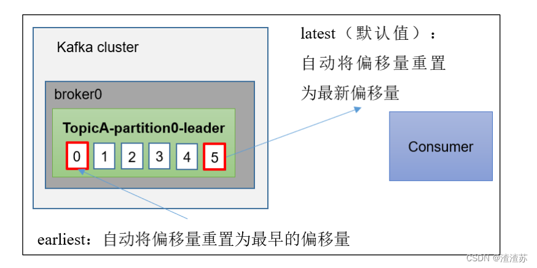
4. 任意指定 offset 位移开始消费

```java
package com.zhengqing.demo.consumer;

import com.google.common.collect.Lists;
import org.apache.kafka.clients.consumer.ConsumerConfig;
import org.apache.kafka.clients.consumer.ConsumerRecord;
import org.apache.kafka.clients.consumer.ConsumerRecords;
import org.apache.kafka.clients.consumer.KafkaConsumer;
import org.apache.kafka.common.TopicPartition;
import org.apache.kafka.common.serialization.StringDeserializer;
import org.junit.Test;
import org.springframework.boot.logging.LogLevel;
import org.springframework.boot.logging.LoggingSystem;

import java.time.Duration;
import java.util.HashSet;
import java.util.Properties;
import java.util.Set;

public class KafkaConsumerTest_07_Offset_Assign_Seek {
    @Test
    public void test() throws Exception {
        this.updateLogLevel();
        // 创建消费者的配置对象
        Properties properties = new Properties();
        // 给消费者配置对象添加参数
        properties.put(ConsumerConfig.BOOTSTRAP_SERVERS_CONFIG, "127.0.0.1:9093");
        // 配置序列化 必须
        properties.put(ConsumerConfig.KEY_DESERIALIZER_CLASS_CONFIG, StringDeserializer.class.getName());
        properties.put(ConsumerConfig.VALUE_DESERIALIZER_CLASS_CONFIG, StringDeserializer.class.getName());
        // 配置消费者组（组名任意起名） 必须
        properties.put(ConsumerConfig.GROUP_ID_CONFIG, "test");

        // 创建 kafka 消费者
        KafkaConsumer<String, String> kafkaConsumer = new KafkaConsumer<>(properties);
        // 订阅主题
        kafkaConsumer.subscribe(Lists.newArrayList("first"));
        Set<TopicPartition> assignment = new HashSet<>();
        while (assignment.size() == 0) {
            kafkaConsumer.poll(Duration.ofSeconds(1));
            // 获取消费者分区分配信息（有了分区分配信息才能开始消费）
            assignment = kafkaConsumer.assignment();
        }
        // 遍历所有分区，并指定 offset 从 10 的位置开始消费
        for (TopicPartition tp : assignment) {
            kafkaConsumer.seek(tp, 10);
        }
        // 消费该主题数据
        while (true) {
            ConsumerRecords<String, String> consumerRecords = kafkaConsumer.poll(Duration.ofSeconds(1));
            for (ConsumerRecord<String, String> consumerRecord : consumerRecords) {
                System.out.println(consumerRecord);
            }
        }
    }

    private void updateLogLevel() {
        LoggingSystem loggingSystem = LoggingSystem.get(LoggingSystem.class.getClassLoader());
        loggingSystem.setLogLevel("org.apache.kafka", LogLevel.WARN);
    }
}
```

注意：每次执行完，需要修改消费者组名；

#### 5、指定时间消费

需求：在生产环境中，会遇到最近消费的几个小时数据异常，想重新按照时间消费。例如要求按照时间消费前一天的数据，怎么处理？

```java
package com.zhengqing.demo.consumer;

import com.google.common.collect.Lists;
import org.apache.kafka.clients.consumer.*;
import org.apache.kafka.common.TopicPartition;
import org.apache.kafka.common.serialization.StringDeserializer;
import org.junit.Test;
import org.springframework.boot.logging.LogLevel;
import org.springframework.boot.logging.LoggingSystem;

import java.time.Duration;
import java.util.*;

public class KafkaConsumerTest_07_Offset_Assign_Seek_Time {
    @Test
    public void test() throws Exception {
        this.updateLogLevel();
        // 创建消费者的配置对象
        Properties properties = new Properties();
        // 给消费者配置对象添加参数
        properties.put(ConsumerConfig.BOOTSTRAP_SERVERS_CONFIG, "127.0.0.1:9093");
        // 配置序列化 必须
        properties.put(ConsumerConfig.KEY_DESERIALIZER_CLASS_CONFIG, StringDeserializer.class.getName());
        properties.put(ConsumerConfig.VALUE_DESERIALIZER_CLASS_CONFIG, StringDeserializer.class.getName());
        // 配置消费者组（组名任意起名） 必须
        properties.put(ConsumerConfig.GROUP_ID_CONFIG, "test");

        // 创建 kafka 消费者
        KafkaConsumer<String, String> kafkaConsumer = new KafkaConsumer<>(properties);
        // 订阅主题
        kafkaConsumer.subscribe(Lists.newArrayList("first"));
        Set<TopicPartition> assignment = new HashSet<>();
        while (assignment.size() == 0) {
            kafkaConsumer.poll(Duration.ofSeconds(1));
            // 获取消费者分区分配信息（有了分区分配信息才能开始消费）
            assignment = kafkaConsumer.assignment();
        }
        HashMap<TopicPartition, Long> timestampToSearch = new HashMap<>();
        // 封装集合存储，每个分区对应一天前的数据
        for (TopicPartition topicPartition : assignment) {
            timestampToSearch.put(topicPartition, System.currentTimeMillis() - 1 * 24 * 3600 * 1000);
        }
        // 获取从 1 天前开始消费的每个分区的 offset
        Map<TopicPartition, OffsetAndTimestamp> offsets = kafkaConsumer.offsetsForTimes(timestampToSearch);
        // 遍历每个分区，对每个分区设置消费时间。
        for (TopicPartition topicPartition : assignment) {
            OffsetAndTimestamp offsetAndTimestamp = offsets.get(topicPartition);
            // 根据时间指定开始消费的位置
            if (offsetAndTimestamp != null) {
                kafkaConsumer.seek(topicPartition, offsetAndTimestamp.offset());
            }
        }
        // 消费该主题数据
        while (true) {
            ConsumerRecords<String, String> consumerRecords = kafkaConsumer.poll(Duration.ofSeconds(1));
            for (ConsumerRecord<String, String> consumerRecord : consumerRecords) {
                System.out.println(consumerRecord);
            }
        }
    }

    private void updateLogLevel() {
        LoggingSystem loggingSystem = LoggingSystem.get(LoggingSystem.class.getClassLoader());
        loggingSystem.setLogLevel("org.apache.kafka", LogLevel.WARN);
    }
}
```

#### 6、漏消费和重复消费

- 重复消费：已经消费了数据，但是 offset 没提交。
- 漏消费：先提交 offset 后消费，有可能会造成数据的漏消费。

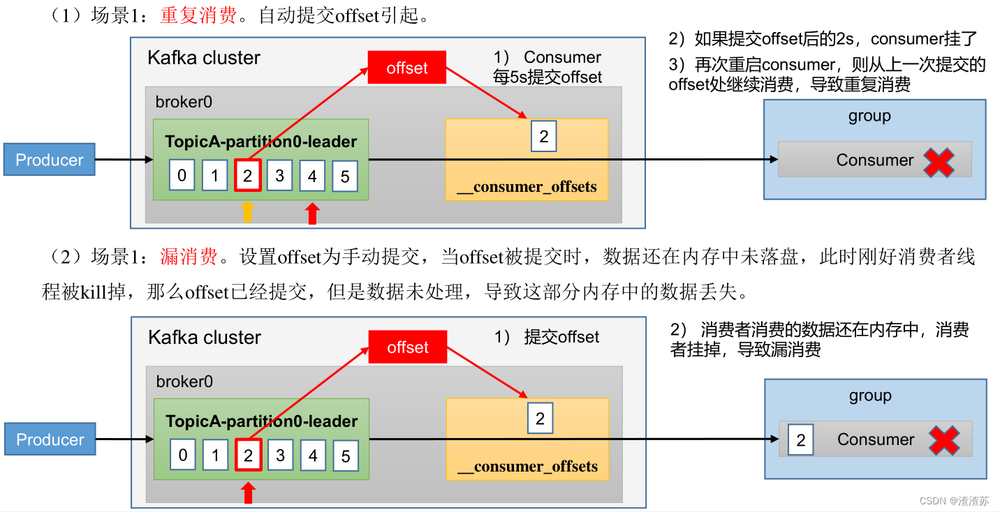

思考：怎么能做到既不漏消费也不重复消费呢？详看消费者事务。

### 六、生产经验 -- 消费者事务

如果想完成Consumer端的精准一次性消费，那么需要Kafka消费端将消费过程和提交offset过程做原子绑定。此时我们需要将Kafka的offset保存到支持事务的自定义介质（比如MySQL）。这部分知识会在后续项目部分涉及。

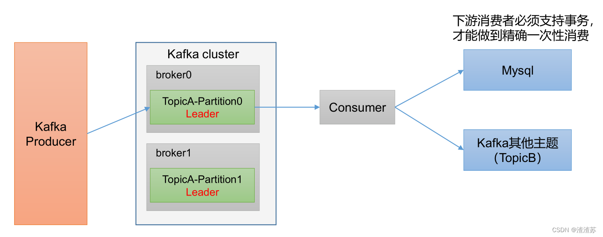

### 七、生产经验 -- 数据积压（消费者如何提高吞吐量）

1. 如果是Kafka消费能力不足，则可以考虑增加Topic的分区数，并且同时提升消费组的消费者数量，消费者数 = 分区数。（两者缺一不可）
2. 如果是下游的数据处理不及时：提高每批次拉取的数量。批次拉取数据过少（拉取数据/处理时间 < 生产速度），使处理的数据小于生产的数据，也会造成数据积压。


| 参数名称             | 描述                                                                                                                                                                            |
|------------------|-------------------------------------------------------------------------------------------------------------------------------------------------------------------------------|
| fetch.max.bytes  | 默认 Default: 52428800（50 m）。消费者获取服务器端一批消息最大的字节数。如果服务器端一批次的数据大于该值（50m）仍然可以拉取回来这批数据，因此，这不是一个绝对最大值。一批次的大小受 message.max.bytes （brokerconfig）or max.message.bytes （topic config）影响。 |
| max.poll.records | 一次 poll 拉取数据返回消息的最大条数，默认是 500 条                                                                                                                                               |

