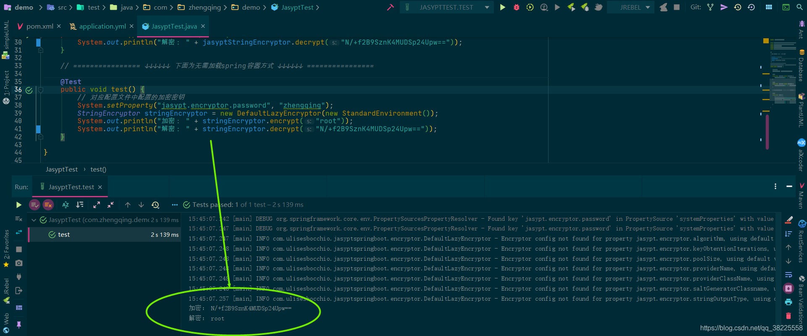
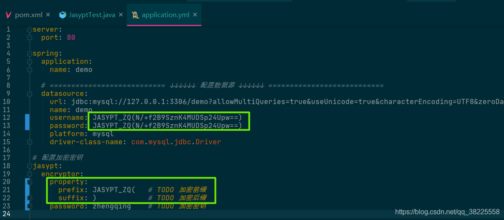
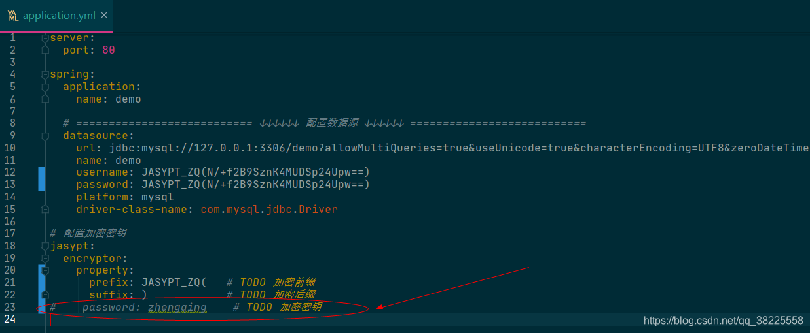
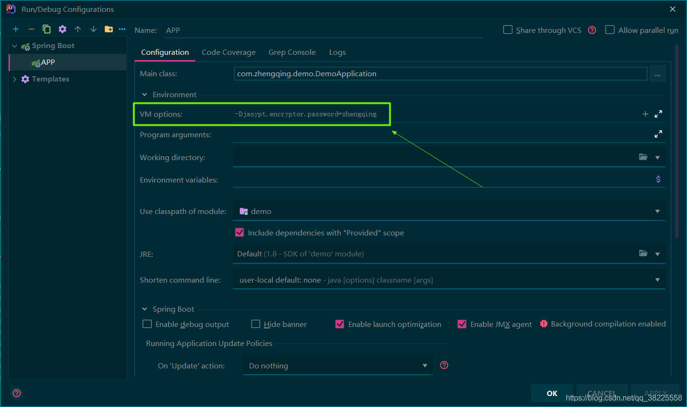

### 一、前言

#### 1、问题

通常项目配置文件中的账号信息如下，都是直接暴露出来的，如果源码不小心泄露将会引起一系列安全问题...


#### 2、解决

1. 通过`配置中心`动态加载配置文件
2. 通过`jasypt`加密组件进行`加密`/`解密`

### 二、`springboot`整合`jasypt` `加密`yml`配置文件`

#### 1、`pom.xml`中引入依赖

```xml
<!-- jasypt加密组件: https://mvnrepository.com/artifact/com.github.ulisesbocchio/jasypt-spring-boot-starter -->
<dependency>
    <groupId>com.github.ulisesbocchio</groupId>
    <artifactId>jasypt-spring-boot-starter</artifactId>
    <version>2.1.0</version>
</dependency>
```

#### 2、`application.yml`中配置加密密钥

```yml
# 配置加密密钥
jasypt:
  encryptor:
    password: zhengqing # TODO 这里密钥修改为自己的！！！
```

#### 3、jasypt加密/解密测试类

```java
public class JasyptTest {
    @Test
    public void test() {
        // 对应配置文件中配置的加密密钥
        System.setProperty("jasypt.encryptor.password", "zhengqing");
        StringEncryptor stringEncryptor = new DefaultLazyEncryptor(new StandardEnvironment());
        System.out.println("加密： " + stringEncryptor.encrypt("root"));
        System.out.println("解密： " + stringEncryptor.decrypt("N/+f2B9SznK4MUDSp24Upw=="));
    }
}
```



#### 4、修改yml配置文件账号信息为加密方式

ex:  `root` -> `ENC(N/+f2B9SznK4MUDSp24Upw==)`

```yml
server:
  port: 80

spring:
  application:
    name: demo

  # =========================== ↓↓↓↓↓↓ 配置数据源 ↓↓↓↓↓↓ ===========================
  datasource:
    url: jdbc:mysql://127.0.0.1:3306/demo?allowMultiQueries=true&useUnicode=true&characterEncoding=UTF8&zeroDateTimeBehavior=convertToNull&useSSL=false # MySQL在高版本需要指明是否进行SSL连接 解决则加上 &useSSL=false
    name: demo
    username: ENC(N/+f2B9SznK4MUDSp24Upw==)
    password: ENC(N/+f2B9SznK4MUDSp24Upw==)
    platform: mysql
    driver-class-name: com.mysql.jdbc.Driver

# 配置加密密钥
jasypt:
  encryptor:
    password: zhengqing # TODO 这里密钥修改为自己的！！！
```

### 三、进阶

#### 1、自定义加密标识

jasypt默认使用`ENC()`来标识加密，加载配置的时候检测到`ENC()`即会自动解密

下面我们来尝试自定义一个加密标识，`JASYPT_ZQ()`

`application.yml`中新增如下配置：

```yml
jasypt:
  encryptor:
    property:
      prefix: JASYPT_ZQ(   # TODO 加密前缀
      suffix: )            # TODO 加密后缀
    password: zhengqing    # TODO 加密密钥
```



#### 2、将`加密密钥`作为`启动运行参数`

以上我们的密钥也是保存在配置文件中的，一旦密钥泄露，信息被解密，安全隐患依然存在！
因此我们可以通过将密钥设置为程序启动时的参数来避免！！！



```java
java -Djasypt.encryptor.password=zhengqing -jar app.jar
```

idea中如下配置运行：



#### 3、自定义加密规则...

网上很多资源，可自行了解


参考： [数据库密码配置项都不加密？心也太大了！](https://mp.weixin.qq.com/s?__biz=MzU4ODI1MjA3NQ==&mid=2247485657&idx=1&sn=90c133b9a72a24ee4fd1c26daada4526&chksm=fddede1dcaa9570b21743ba8bb6e7664b6e7cbe19e22428e3b0c39d510f4d39e8c6e97979452&mpshare=1&scene=1&srcid=&sharer_sharetime=1587779354864&sharer_shareid=936076bf8d5bee83e89fd7e769b5c6db&key=f507b9b0259644edd1f930974d4889b0f82cb18afcc994eba182eaaaa6f508cf83e90a83181f96c8f3d48c33bbc9a1c4c4ff1595199e910bab8600804a8ed5b46565f278480da81da8f454cfc2d61879&ascene=1&uin=MTg4MzA0MzMxNA==&devicetype=Windows%2010%20x64&version=62090070&lang=zh_CN&exportkey=AR8HvbeJI12kmZ%2buYybssq8=&pass_ticket=pn0NjMXu38wvdRXcouFgoGaFNJda4reHhGX6y6WRvmkqxyGFVPO7G59P1tsfao3r)


---


### 本文案例demo源码

[https://gitee.com/zhengqingya/java-workspace](https://gitee.com/zhengqingya/java-workspace)

